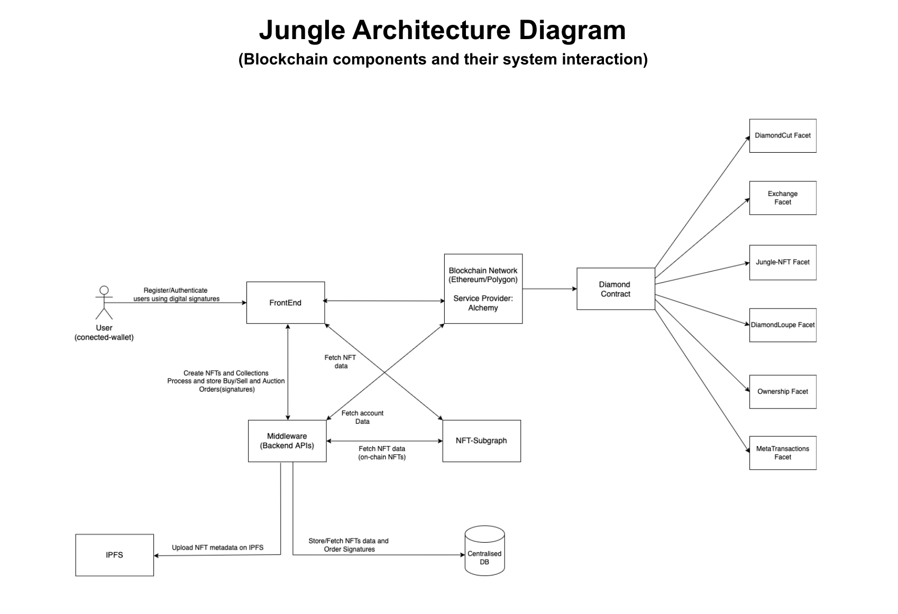

## Description

<a href="" target="_blank"></a>

# JUNGLE NFT MARKETPLACE

Jungle is one of the largest nft marketplace for crypto collectibles and non-fungible tokens(NFTs). Buy, Sell, Create and Discover exclusive digital items.

### Project architecture



The user can access the application via web-browser, and he must have the Metamask wallet installed. This interface, built with React.js, relies on the web3.js library to communicate with the smart contracts through Metamask. This means that the data reflected on the front-end application is fetched from the Ethereum blockchain. Each action performed by the user (mint a NFT, offer NFT, buy NFT...) creates a transaction on Ethereum, which will require Metamask confirmation and pay a small fee, and this transaction will permanently modify the state of the NFTCollection and NFTMarketplace smart contracts. On top of it, the user will upload the NFT Metadata to the IPFS, creating a permanent hash which will be permanently recorded on the blockchain itself to prove ownership.

### NFT Marketplace features

The user can perform the following actions on this NFT Marketplace:

#### Mint

The user must input a name, description and upload a file (image) to mint his own NFT. Once minted, a representation of this NFT will be displayed in the marketplace and initially it will be owned by its creator. This is open for everyone, meaning everyone can participate in this NFT creation within this collection.

#### Make Offer

The user can offer his NFT by specifying its price (in Ether). If someone fulfills this offer, then the ownership is transferred to a new owner.

#### Cancel Offer

The user can cancel an offer he did in the past if in the end he does not want to sell his NFT or wants to adjust the price.

#### Buy

A user can buy those NFT which someone else offered. This will require paying the requested price (the Ether will be transferred to the smart contract to be claimed later on).


```
## Pre-Configuration


**package.json**
----------

- Windows:
  "start:dev": "set STAGE=dev& nest start --watch",

- Linux / Ubuntu / Mac:
  "start:dev": "STAGE=dev nest start --watch",

- Set up .env file with required credentials, secret keys.

## Installation

bash
$ npm install


## Running the app

bash
# development
$ npm run start

# watch mode
$ npm run start:dev

# production mode
$ npm run start:prod

## Test

bash
# unit tests
$ npm run test

# e2e tests
$ npm run test:e2e

# test coverage
$ npm run test:cov
```
